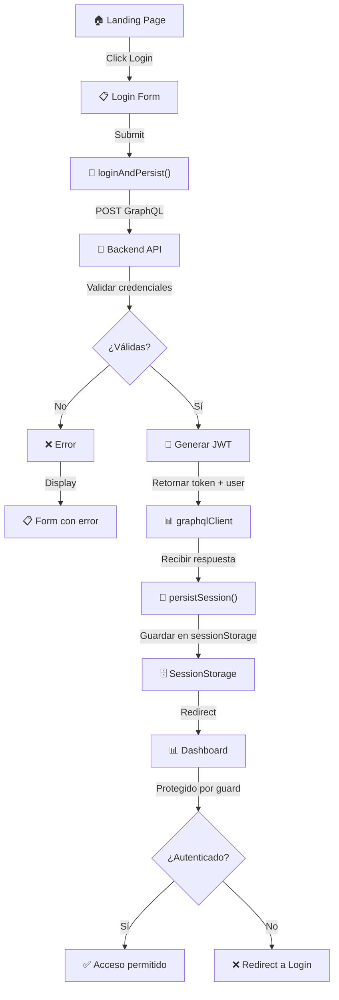

# Implementación del Sistema de Autenticación - Login

## 📋 Resumen

Se ha implementado un sistema completo de autenticación con **Login** que incluye:

1. **Autenticación mediante GraphQL** - Mutation `loginUser`
2. **Persistencia de sesión** - Almacenamiento en `sessionStorage`
3. **Protección de rutas** - Guards para proteger vistas autenticadas
4. **Manejo de tokens JWT** - Inclusión automática en peticiones API

---

## 🔐 Flujo de Login

```
Usuario introduce email/contraseña
                 ↓
        Componente Formulario.vue
                 ↓
    Llama a loginAndPersist(email, password)
                 ↓
    Envía mutation GraphQL a /graphql
                 ↓
    Recibe accessToken + datos del usuario
                 ↓
    Guarda datos en sessionStorage (granular)
                 ↓
    Redirige a /dashboard
```

---

## 📦 Datos Guardados en SessionStorage

Después de un login exitoso, se guardan los siguientes datos en `sessionStorage`:

```javascript
{
  accessToken: "eyJhbGciOiJIUzI1NiIsInR5cCI6IkpXVCJ9...",
  userId: "f7a0e2b5-b422-456f-95f7-23aa6c45c075",
  email: "pepe@pepon.com",
  isActive: "true",  // Guardado como string, se convierte a boolean al leer
  role: "USER"
}
```

### Estructura de Almacenamiento (Granular)

Cada dato se almacena de forma individual en `sessionStorage`, similar a cómo se hace con el registro:

```javascript
sessionStorage.setItem('accessToken', token)
sessionStorage.setItem('userId', user.userId)
sessionStorage.setItem('email', user.email)
sessionStorage.setItem('isActive', user.isActive ? 'true' : 'false')
sessionStorage.setItem('role', user.role)
```

---

## 🔧 Servicios Implementados

### 1. `authService.js` - Servicio de Autenticación

#### Función: `loginAndPersist(email, password)`
Realiza el login del usuario y persiste los datos.

```javascript
import { loginAndPersist } from '@/services/authService'

try {
  await loginAndPersist('pepe@pepon.com', '12345678')
  // Login exitoso, sesión guardada
} catch (error) {
  console.error('Error en login:', error.message)
}
```

#### Función: `getSession()`
Obtiene los datos completos de la sesión actual.

```javascript
const session = getSession()
if (session) {
  console.log('Usuario:', session.email)
  console.log('Token:', session.accessToken)
}
```

#### Función: `isAuthenticated()`
Verifica si hay una sesión activa.

```javascript
if (isAuthenticated()) {
  // Usuario está autenticado
  router.push('/dashboard')
} else {
  // Redirigir a login
  router.push('/login')
}
```

#### Función: `getAccessToken()`
Obtiene solo el token de acceso.

```javascript
const token = getAccessToken()
// Usar token para peticiones autenticadas
```

#### Función: `logout()`
Cierra la sesión eliminando todos los datos.

```javascript
logout()
// Todos los datos se eliminan de sessionStorage
```

---

### 2. `graphqlClient.js` - Cliente GraphQL

Se ha mejorado para incluir automáticamente el token de autorización en las peticiones:

```javascript
export async function postGraphQL(query, variables = {}) {
  const headers = {
    'Content-Type': 'application/json',
  }

  // Incluir el token de autorización si está disponible
  const token = getAccessToken()
  if (token) {
    headers['Authorization'] = `Bearer ${token}`
  }
  
  // ... resto de la lógica
}
```

---

## 🛣️ Rutas Protegidas

Las siguientes rutas requieren autenticación (tienen `meta.requiresAuth: true`):

- `/dashboard` - Dashboard
- `/analyze` - Análisis
- `/diagnostic` - Diagnóstico
- `/evolution` - Evolución

Las rutas de `/login` y `/register` redirigen a `/dashboard` si el usuario ya está autenticado.

---

## 🎯 Guard de Rutas

El `router.beforeEach()` implementa la lógica de protección:

```javascript
router.beforeEach((to, from, next) => {
    const hasAuth = isAuthenticated()
    const requiresAuth = to.matched.some(record => record.meta.requiresAuth)

    // Si requiere auth y no hay sesión → ir a login
    if (requiresAuth && !hasAuth) {
        next({ name: 'Login' })
    }
    // Si intenta ir a login/register estando autenticado → ir a dashboard
    else if ((to.name === 'Login' || to.name === 'Register') && hasAuth) {
        next({ name: 'Dashboard' })
    }
    else {
        next()
    }
})
```

---

## 📡 Mutation GraphQL Utilizada

### Login User

```graphql
mutation LoginUser {
  loginUser(email: "pepe@pepon.com", password: "12345678") {
    accessToken
    user {
      userId
      email
      isActive
      role
      createdAt
    }
  }
}
```

**Respuesta exitosa:**
```json
{
  "data": {
    "loginUser": {
      "accessToken": "eyJhbGciOiJIUzI1NiIsInR5cCI6IkpXVCJ9...",
      "user": {
        "userId": "f7a0e2b5-b422-456f-95f7-23aa6c45c075",
        "email": "pepe@pepon.com",
        "isActive": true,
        "role": "USER",
        "createdAt": "2026-05-01T10:33:01.568523+00:00"
      }
    }
  }
}
```

---

## 🧩 Componentes Involucrados

### 1. `LoginView.vue`
Contenedor que renderiza el formulario de login.

```vue
<template>
  <div>
    <Header/>
    <Formulario page="login"/>
    <Footer/>
  </div>
</template>
```

### 2. `Formulario.vue`
Componente reutilizable que maneja tanto login como registro.

- Cuando `page="login"`: Muestra formulario de login
- Cuando `page="register"`: Muestra formulario de registro
- Llama a `loginAndPersist()` para login
- Llama a `registerAndLogin()` para registro
- Redirige a `/dashboard` en ambos casos

---

## ✅ Verificación de Funcionalidad

Para verificar que todo funciona correctamente:

### 1. Test de Login en GraphQL Playground

```graphql
mutation {
  loginUser(email: "pepe@pepon.com", password: "12345678") {
    accessToken
    user {
      userId
      email
      isActive
      role
    }
  }
}
```

### 2. Verificar SessionStorage en Console del Navegador

```javascript
// En la consola del navegador ejecutar:
console.table(sessionStorage)

// Deberías ver:
// accessToken: "eyJ..."
// userId: "f7a0e2b5..."
// email: "pepe@pepon.com"
// isActive: "true"
// role: "USER"
```

### 3. Probar Protección de Rutas

- Sin autenticación: Acceder a `/dashboard` → Redirige a `/login`
- Con autenticación: Acceder a `/login` → Redirige a `/dashboard`

---

## 🔄 Comparación: Login vs Registro

| Aspecto | Login | Registro |
|--------|-------|----------|
| **Mutation** | `loginUser` | `registerAndLogin` |
| **Función** | `loginAndPersist()` | `registerAndLogin()` |
| **SessionStorage** | Granular (fields individuales) | Granular (fields individuales) |
| **Ruta destino** | `/dashboard` | `/dashboard` |
| **Parámetros** | email, password | email, password |
| **Creación usuario** | No (debe existir) | Sí (crea nuevo usuario) |

---

## 🚀 Uso en Componentes

### Ejemplo: Logout en Componente

```vue
<script setup>
import { logout } from '@/services/authService'
import { useRouter } from 'vue-router'

const router = useRouter()

const handleLogout = () => {
  logout()
  router.push({ name: 'Login' })
}
</script>

<template>
  <button @click="handleLogout">Cerrar sesión</button>
</template>
```

### Ejemplo: Mostrar Datos del Usuario

```vue
<script setup>
import { getSession } from '@/services/authService'

const session = getSession()
</script>

<template>
  <div v-if="session">
    <p>Hola, {{ session.email }}</p>
    <p>Rol: {{ session.role }}</p>
  </div>
</template>
```

---

## 📝 Archivos Modificados

1. **`frontend/src/services/authService.js`**
   - Mejorado almacenamiento granular de sesión
   - Agregadas funciones de utilidad
   - Implementación de `loginAndPersist()`

2. **`frontend/src/services/graphqlClient.js`**
   - Inclu automática del token en headers
   - Mejor manejo de errores

3. **`frontend/src/router/index.js`**
   - Agregadas rutas protegidas con `meta.requiresAuth`
   - Implementado guard de navegación

---

## 🎓 Flujo Completo de Autenticación



---

## 🐛 Solución de Problemas

### Error: "Credenciales invalidas"
- Verificar que el email y password sean correctos
- Asegurar que el usuario existe en la base de datos

### Error: "No se pudo conectar al servidor"
- Verificar que el backend está corriendo en `http://localhost:8000`
- Revisar que el `GRAPHQL_ENDPOINT` está configurado correctamente

### No se redirige a dashboard
- Verificar que no hay errores en las funciones de persistencia
- Comprobar que `sessionStorage` contiene los datos
- Revisar la consola del navegador para errores

### Sesión se pierde al recargar
- Esto es normal: `sessionStorage` se limpia al cerrar la pestaña
- Para persistencia permanente, usar `localStorage` en su lugar

---

## 📚 Documentación Adicional

- **Backend**: Ver `ENTREGA_BACKEND_FASE_1.md` para detalles del API GraphQL
- **Rutas**: Todas las rutas están centralizadas en `frontend/src/router/index.js`
- **Configuración**: Variables de entorno en `frontend/.env` (si existe)

